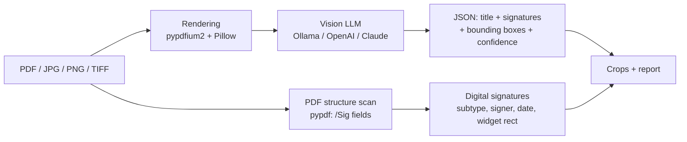

# Signum — document categorization and signature detection

[](https://www.python.org/)
[](https://doc.qt.io/qtforpython-6/)
[](https://mypy-lang.org/)
[](https://docs.astral.sh/ruff/)
[](LICENSE)

A Windows desktop application with two separate workspaces:
**document categorization** and **signature detection**.

The **Kategoryzowanie dokumentów** tab classifies PDF text into 2–12 editable
categories. Add your own model configurations: Ollama, an API with a custom URL,
model and key (Chat Completions, Messages or Decisions), or a local JevK5 runtime.
Compare any selected configurations sequentially on identical text inputs. Categories and prompts
are saved independently of signature settings. Load your own PDFs, sample up to
100 files from a folder, or open a locally saved benchmark protocol. Small color markers connect labels with results. The compact desktop layout puts
documents and file commands first; expand **Instrukcja klasyfikacji** to edit the
English default prompt, and **Pomiary** to inspect model timings. Both tabs show preparation, local loading, model processing and total
times. Test connections in **Ustawienia AI** and double-click a PDF to open it.
Results and timings can be exported to CSV or JSON.
Use **Skopiuj do folderów…** or **Przenieś do folderów…** to organize the selected
collection into label-named folders. Choose a destination, select a model/pass
when comparing runs, and review every target path before applying the operation.
Existing files are never overwritten; duplicate names receive numbered suffixes.
Files without a successful classification are skipped. Moves verify the copied
bytes before deleting the source and update paths in both workspaces and reports.
Cancellation keeps completed files and leaves the remaining sources in place.
**Test PDFs are local only and are not included in the repository or installer.**
Git ignores PDF inputs; CI and the installer build check delivery inputs with
`scripts/check_local_documents.py`. See the [Polish usage guide](docs/INSTRUKCJA.pl.md).

The **Sprawdzanie podpisów** tab keeps the existing visual and structural analysis:

Drop in up to a thousand scans and PDFs, click *Przetwórz* (Process), and Signum:

- gives every file a short **AI-generated title** (e.g. `Skan_01.jpeg` → *"Formularz świadomej zgody"*),
- detects **handwritten signatures, initials (parafki), stamps** — visually, with a vision LLM,
- detects **all common digital signature types** — deterministically, from PDF structure
  (PAdES/CAdES, CMS/PKCS#7, X.509, RFC 3161 timestamps, certification signatures/DocMDP,
  usage-rights signatures),
- reports a **confidence score** for every detection,
- shows a **cropped image of each signature** so a human can verify at a glance,
- exports a self-contained **HTML report** (crops embedded, plus a page thumbnail
  with the detection box marked for every finding) and **CSV**.

> Signum detects the **presence** of signatures. It does not verify their cryptographic
> validity or legal force.

## How it works



Two independent detection paths are combined per document:

1. **Visual path** — every page is rendered to an image and sent to a vision model with a
   structured-output JSON schema. The model returns a short document description and a list
   of visible signatures (`handwritten` / `initials` / `stamp`) with normalized bounding
   boxes (`[ymin, xmin, ymax, xmax]`, 0–1000 scale) and confidence 0–100. Boxes are
   validated, padded and cropped from the full-resolution render.
2. **Structural path (PDF only)** — signature form fields are read directly from the PDF.
   A filled `/Sig` field *is* a digital signature (confidence 100), classified by
   `/SubFilter`; the visible signature widget is cropped from the rendered page.

Files are processed **sequentially** with a progress bar and ETA — memory usage stays flat
even for 1000-file batches. A per-file error never stops the batch; a lost AI connection
aborts it with a clear message.

## AI providers

| Provider | Configuration | Notes |
|---|---|---|
| **Ollama** (default) | API URL + model picked from the installed list + optional API key | Tested with `gemma4:12b`. |
| **OpenAI-compatible API** | base URL + API key + model | Works with OpenAI, OpenRouter and any `/chat/completions`-compatible endpoint. |
| **Claude (Anthropic)** | base URL + API key + model | Messages API with base64 image blocks. Default URL: `https://api.anthropic.com/v1`. |
| **vjev-vision** | base URL + served model ID + optional API key + local runtime directory | Default: `http://localhost:8800/v1`, model ID `vjev-vision`. Uses [vjev-serve](https://github.com/BubbleCal/vjev-serve) `/systemone`. A prepared local CUDA runtime is started automatically during connection testing or analysis; remote API servers can also be used. |

Local runtimes live in the folder selected during setup. **Składniki AI** installs
Python, CUDA libraries and the chosen Jev or JevK5 model, or reuses an existing
installation after dependency and inference checks. `runtime.json` specifies the
absolute `python`, `packages`, and `model_dir` paths. Startup is offline and binds
only `127.0.0.1`; it does not download models. The settings button **Zatrzymaj lokalny
Jev / zwolnij GPU** stops only the server managed by Signum. Logs: `server.log`.
An unprepared runtime produces an actionable error instead of raw connection traces.
The GUI installer itself does not include the 9 GB model or CUDA libraries.
For local diagnostics, `Signum.exe --self-test-jev` tests the prepared default
localhost model from the packaged application and saves `packaged-self-test.json`
in the runtime directory; it does not read cloud settings or use cloud API keys.

Ollama and Jev have independent **Dodatkowa analiza** checkboxes. Ollama keeps
its existing description-and-crops mode enabled by default; disabling it requests
only signature and stamp presence. Jev keeps its frozen basic classifier by default;
the optional experimental extension adds up to two of 48 categories and approximate
crops using a 4 × 5 grid, adjacent-cell fusion and verification. The extension
preserves the basic presence decision. CLI equivalents are `--additional-analysis`
and `--no-additional-analysis`. See [the Polish guide](docs/INSTRUKCJA.pl.md).

Every provider has an editable API address, model field and protected API key field,
with *Pokaż*, *Wyczyść*, *Testuj połączenie* and *Zapisz*. Enter the **base URL**
(including `/v1` where shown), not the full inference route. Local processing is
recognized by the selected endpoint's loopback address (`localhost`, `127.0.0.1`, `::1`),
including vjev and compatible on-prem API servers. Remote endpoints require HTTPS.

Jev uses a separate editable default prompt, nine typed questions and five views
of each page: the full page and four overlapping quarters. The largest view score
at or above **0.535** indicates a visible handwritten signature or initials.
The displayed probability uses calibration fitted on the experimental sample;
it is also shown for negative results and is not a guarantee for other documents.
Stamps are reported separately and do not make a document signed.
**Basic Jev does not count signatures or return signature crops.** Open the source
document from the results panel to verify it. Digital PDF signatures are still
scanned and cropped independently; Jev results retain the filename as their title.
The managed local Jev server releases GPU memory after an analysis batch.

*Testuj połączenie* for Jev checks the selected model and sends a small synthetic
image, which may incur API charges. A successful test validates transport and response
shape; it does not measure detection quality. The five-view method achieved 120/120
on the closed research sample, including tuning pages; both Jev and binary Gemma
achieved 20/20 on the fresh confirmation subset. API cost has not been measured.
The transport follows the
[vjev API contract](https://github.com/BubbleCal/vjev-serve#the-api).
The integration checks and research limitations are recorded in
[the local Jev validation report](docs/JEV_VALIDATION.pl.md), including latency,
the Gemma4 comparison, and limitations.

API keys are stored in the **Windows Credential Manager** (via `keyring`) — never in
config files. Settings live in `%APPDATA%\Signum\settings.json`.

The vision model must support images. On this project's reference setup —
[Gemma 4 12B](https://blog.google/innovation-and-ai/technology/developers-tools/introducing-gemma-4-12b/)
via Ollama — a page takes ~8–30 s and bounding boxes land with IoU 0.6–0.9.
Note: Ollama currently hard-codes Gemma 4's visual token budget to 280
(≈0.65 Mpx per page — an A4 page is seen at ~672×912 px), so image sizes above
1120 px mainly benefit cloud models. Because model-reported boxes are
approximate by nature, the HTML report pairs every crop with a page thumbnail
showing where the model pointed.

Switching from a local endpoint to any remote endpoint triggers a warning dialog
(documents will leave your machine) with a 3-second hold on the confirm button,
and a red **"Model online"** badge stays visible while the selected configuration
is remote. Remote endpoints must use HTTPS. Starting a batch requires one explicit
risk acknowledgement for the entire queue — Signum does not interrupt the user
for every added document. Before that acknowledgement Signum performs a preflight
which verifies that the selected service and model are actually available.

## Installation

### Installer (recommended)

Signum is a demo project. Download [Signum-Setup-1.1.4.exe](installer/output/Signum-Setup-1.1.4.exe)
and its [SHA-256 checksum](installer/output/Signum-Setup-1.1.4.exe.sha256).
Run the installer to begin setup. Per-user install,
no administrator rights required. Polish and English installer languages. The
installer contains the Python runtime and application libraries, so a separate
Python installation is not required for Signum itself. The installer offers optional
third-party components and detects dedicated GPU memory through DXGI: Gemma 4 E2B
for an 8 GB GPU, Gemma 4 12B for 16 GB, and Jev (signatures) / JevK5 (text classification) for NVIDIA 16 GB.
These are conservative memory recommendations, not performance guarantees.
Choose the components and their storage folder; a progress window then downloads,
prepares and checks the selected AI, and configures Signum without terminal commands.
Existing running Ollama services and prepared Jev / JevK5 runtimes can be reused.
**Składniki AI** in either workflow provides checks, installation and repair, including
additional named Ollama models. Errors include recovery steps for libraries, drivers,
memory, disk space and API authentication. Without H:, storage defaults to the user's
Documents/SignumAI; the user can choose another drive. Model profiles are configured
after a successful inference test. The check-only action performs no downloads.
External components retain their own licences and remain after uninstalling Signum.
Downloads occur only for components selected by the user. The
installer includes a separate document-and-AI risk page with four required
acknowledgements covering human verification, authorization to process files,
local AI processing, and transfer to an Internet provider. Silent installation
requires `/ACKNOWLEDGERISKS=1`.

### From source

```powershell
git clone <repository-url>
cd signum
python -m venv .venv
.venv\Scripts\python -m pip install --upgrade pip==26.1.2
.venv\Scripts\pip install --build-constraint constraints.txt -c constraints.txt -e .[dev]
.venv\Scripts\signum          # GUI
```

For local AI: install [Ollama](https://ollama.com) and pull a vision model:

```powershell
ollama pull gemma4:12b
```

## Usage

**GUI:** start Signum → (first run) *Ustawienia AI* → choose provider and model →
drag & drop files/folders or use *Dodaj pliki…* / *Dodaj folder…* → *Przetwórz* →
confirm the single risk notice for the whole batch → review results and signature
crops → *Zapisz raport…* (HTML/CSV).

**CLI** (automation / batch jobs):

```powershell
signum-cli C:\skany --html raport.html --csv raport.csv --acknowledge-risks
signum-cli umowa.pdf skan.jpg --provider ollama --model gemma4:12b --max-pages 5 --acknowledge-risks
```

Without `--acknowledge-risks`, CLI prints the complete risk notice and exits
without connecting to an AI service or processing documents.

Exit codes: `0` when the batch finishes without document errors, `1` when a
document fails or the batch is interrupted by a connection error, and `2` for
invalid arguments, missing input, missing risk acknowledgement, or failed preflight.
Reports are still written for batches containing document errors. A failed or
incomplete PDF structure scan is reported as an error, not as absence of signatures.

## Configuration

| Setting | Default | Meaning |
|---|---|---|
| `provider` | `ollama` | `ollama` / `openai` / `anthropic` / `vjev` |
| `ollama_url` | `http://localhost:11434` | Ollama endpoint |
| `ollama_model` | `gemma4:12b` | must be a vision model |
| `ollama_num_ctx` | `8192` | context window sent as `options.num_ctx` (Ollama's own default is only 4096) |
| `openai_base_url` | `https://api.openai.com/v1` | OpenAI-compatible API base URL |
| `anthropic_base_url` | `https://api.anthropic.com/v1` | Claude Messages API base URL |
| `vjev_base_url` | `http://localhost:8800/v1` | vjev-serve API base URL |
| `vjev_model` | `vjev-vision` | model ID advertised by `/v1/models` |
| `vjev_runtime_dir` | `H:/Tools/SignumJev` | prepared local CUDA runtime; used only for loopback auto-start |
| `max_pages_per_doc` | `10` | pages analyzed per document |
| `model_image_max_side` | `1120` px | page image size sent to the model |
| `custom_prompt` | `""` | user-edited task part of the prompt; empty = built-in (the JSON response format is always appended automatically) |
| `jev_custom_prompt` | `""` | vjev decision instructions; separate from the LLM prompt, without a generated JSON schema |
| `timeout_s` | `300` | per-request AI timeout |
| `recursive_folders` | `true` | recurse into subfolders |

## Development

```powershell
.venv\Scripts\pip install --build-constraint constraints.txt -c constraints.txt -e .[dev]
.venv\Scripts\python -m pytest            # no network needed
.venv\Scripts\python -m ruff check src tests scripts
.venv\Scripts\python -m mypy
.venv\Scripts\pip-audit
.venv\Scripts\python scripts\generate_fixtures.py   # example documents in examples/
```

Test documents (including **genuinely digitally-signed PDFs** — pyhanko with a self-signed
certificate) are generated on the fly by `tests/docfactory.py`; no binary fixtures in the repo.

### Building the installer

Requires [Inno Setup 6](https://jrsoftware.org/isinfo.php).

```powershell
powershell -ExecutionPolicy Bypass -File scripts\build_installer.ps1
# → installer\output\Signum-Setup-<version>.exe
```

The build script runs a self-test of the packaged executable before invoking
Inno Setup. This verifies the bundled Python runtime, required libraries and UI
resources rather than merely checking that an `.exe` file exists. It also prints
and saves the SHA-256 digest next to the installer.
The current demo installer and its checksum are tracked in Git; other build outputs are ignored.

### Project structure

```
src/signum/
├── app.py            # GUI entry point
├── cli.py            # headless batch mode (signum-cli)
├── config.py         # settings JSON + API keys in Credential Manager
├── ai/               # vision clients (Ollama, OpenAI, Claude, vjev),
│                     # generation/decision prompts and response parsers
├── core/             # domain models, file discovery, PDF/image rendering,
│                     # digital signature scan, bbox cropping, batch pipeline
├── report/           # self-contained HTML + CSV export
└── ui/               # PySide6 main window, settings dialog, worker threads
```

Design notes live in [docs/ARCHITECTURE.md](docs/ARCHITECTURE.md);
a Polish user guide in [docs/INSTRUKCJA.pl.md](docs/INSTRUKCJA.pl.md).

## Privacy & limitations

- With an AI API at a loopback address, documents are processed locally, but their
  contents are still passed to an AI model. A LAN or Internet API endpoint is
  remote and is labelled as such. Local execution alone does not determine whether
  the processing is authorized or appropriate.
- With cloud providers, page images are sent to the provider's API — check your
  organization's policy before use. Signum makes this explicit: a countdown
  warning when switching away from the local provider and a persistent
  "Model online" badge in the status bar.
- Visual detection is probabilistic: confidence scores and crops exist precisely so that
  a human can verify. Digital-signature detection is structural and exact, but Signum
  **does not** validate certificates, revocation or document integrity.
- The user is responsible for authorization to process the selected documents,
  applicable organizational and confidentiality requirements, and verifying that
  results are fit for the intended purpose. A Signum result must not be the sole
  basis for a legal, business, or organizational decision.
- HTML reports contain signature crops and page thumbnails derived from source
  documents. CSV and HTML contain document file names, but never full local paths.
  Treat exported reports as confidential and review them before sharing.
- Encrypted PDFs that require a password are reported as errors (structure scan is skipped).

## License

[MIT](LICENSE)
