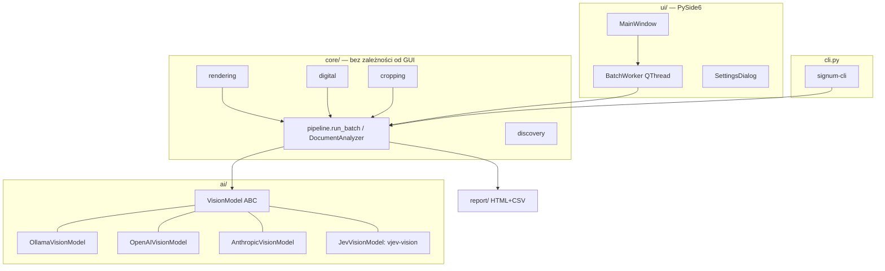

# Signum — architecture notes

## Goals & constraints

- **Separate workflows:** PDF text categorization and signature detection have independent
  queues, settings, prompts, results and exports. Signature detection asks *is this document signed?*
  with human-verifiable
  evidence (crops + confidence), not a black-box verdict.
- **Batch-scale:** up to ~1000 files in one run → sequential processing, flat memory
  profile, per-file fault isolation, progress + ETA + cancellation.
- **Model-agnostic:** local Ollama by default; any OpenAI-compatible or Anthropic API
  as a drop-in via one abstract interface.
- **Portfolio-grade hygiene:** typed (mypy), linted (ruff), tested (pytest + pytest-qt),
  permissive licenses only (hence `pypdfium2` instead of AGPL PyMuPDF).

## Layering

Text categorization uses `ui/classification_panel.py` and `ClassificationWorker`,
with orchestration and result types in `core/classification.py`. It never invokes
the signature pipeline. `ai/model_profiles.py` stores configurable model identities
and endpoint settings without secrets; `ui/models_dialog.py` edits them and tests
connections using synthetic text. `ai/text_classifiers.py` implements Chat Completions,
Messages, Decisions and Ollama JSON choices. JevK5 runs in an owned external Python/CUDA process through
`jevk5_text_worker.py`, shipped as data in the GUI package. Tokenization happens
once before a comparison; text hashes remain identical across providers and repeats.
Each model is released before the next, and the two UI workflows cannot run together.
Venice rate-limit waits are cancellable and included in measured classification time.
Local load requests are timed separately from inference, without cloud warmups.
Signature clients track HTTP request durations and Ollama loading metadata so image
preparation is excluded from inference. Timings survive partial failures and cancellation.
Both workflows use `ui/batch_risk_dialog.py` before starting.

Zasada: **`core/` i `ai/` nie importują niczego z Qt** — GUI i CLI to cienkie
nakładki na ten sam pipeline. Postęp i anulowanie przechodzą przez callbacki
i `CancelToken` (thread-safe `threading.Event`).

## Detection model

Dwie niezależne ścieżki, łączone per dokument:

| Ścieżka | Co wykrywa | Jak | Pewność |
|---|---|---|---|
| wizyjna | podpis odręczny, parafka, pieczątka | render strony → vision LLM → JSON (schemat egzekwowany promptem + odpornym parserem; structured outputs tylko w ponowieniu) | deklarowana przez model 0–100 |
| wizyjna Jev | obecność podpisu odręcznego lub parafki; pieczątka osobno | pełna strona + cztery zachodzące ćwiartki → dziewięć pytań typowanych → największa średnia czterech ocen, próg 0,535 | prawdopodobieństwo kalibrowane na próbie eksperymentalnej, także dla wyników ujemnych |
| strukturalna (PDF) | podpisy cyfrowe: PAdES/CAdES, PKCS#7 (adbe), X.509, znaczniki czasu RFC 3161, podpisy certyfikujące DocMDP, UR3 | pypdf: pola `/FT /Sig` z `/V`, klasyfikacja po `/SubFilter` | 100 (fakt strukturalny) |

Kluczowe decyzje:

- **vjev:** nadpisuje `VisionModel.analyze_image` i zwraca wspólny
  `PageAnalysis`. Wysyła `state` z obrazem base64 do `/systemone`. Prompt decyzyjny jest
  zapisany osobno jako `jev_custom_prompt`. Pięć widoków powstaje przed zmniejszeniem
  obrazu; każdy JPEG ma limit 1120 px. Parametry metody są zamrożone w
  `ai/jev_signature.py` i porównywane z protokołem badania w testach.
  Podstawowy Jev nie zlicza podpisów, nie podaje ramek ani nie klasyfikuje rodzaju dokumentu.
  Opcjonalne `vjev_additional_analysis` uruchamia `jev_additional.enrich_analysis`
  dopiero po zamrożonej regule: 48 niezależnych pytań o kategorie (top 2 powyżej
  0,6), 20 kafelków, spójne składowe ośmiu sąsiadów i ponowna ocena scalonych
  wycinków. Lokalizacja nie dodaje ani nie usuwa podstawowego wykrycia ani nie
  zmienia `signature_probability`. Jej oceny nie są kalibrowane; ramki są przybliżone.
  Brakujące lub niepoprawne decyzje powodują `AIResponseError`, nigdy pusty wynik
  oznaczający brak podpisu. Preflight sprawdza listę modeli i syntetyczny obraz.
  Lokalność każdego dostawcy zależy od rzeczywistego adresu wybranego API.
  Przy braku lokalnego serwera `local_vjev` uruchamia osobny proces Python z
  przygotowanego `runtime.json`, czeka na załadowanie prawdziwych wag i powtarza
  preflight. `vjev_bootstrap.py` jest zasobem instalatora, nie importem GUI:
  Torch i model pozostają na H:. Serwer jest offline, tylko IPv4 loopback,
  z blokadą startu per port. Zatrzymanie wymaga osobnego losowego tokenu sterowania;
  nie zatrzymuje serwerów innych dostawców ani dowolnych procesów.
  Worker i CLI zwalniają zarządzany serwer po zakończeniu lub anulowaniu analizy.

- **Podpisy cyfrowe NIE są wykrywane przez LLM.** Obecność wypełnionego pola `/Sig`
  to fakt; pytanie modelu wizyjnego o nie byłoby mniej wiarygodne. Widget podpisu
  (jeśli widoczny, `/Rect` o niezerowej powierzchni) jest wycinany z renderu strony
  po przeliczeniu współrzędnych PDF (origin lewy-dolny, punkty) na piksele.
  Przeliczenie uwzględnia `/Rotate` oraz początek widocznego obszaru strony.
  Typ pola `/FT` jest dziedziczony w hierarchii formularza; osobne widgety
  tego samego pola nie zwiększają liczby podpisów.
- **Pamięć renderowania:** `open_pages` udostępnia kolejno strony PDF i klatki TIFF.
  Obraz strony jest zwalniany przed następną stroną, a kontekst zamyka dokument
  także przy błędzie lub anulowaniu. W wynikach pozostają tylko wycinki i miniatury.
- **Puste pola podpisu** są raportowane osobno i nie liczą się jako podpis.
- **bounding boxy:** konwencja `[ymin, xmin, ymax, xmax]` w skali 0–1000
  (zbadana empirycznie na gemma4:12b — IoU 0.6–0.9). Ramki są walidowane
  (uporządkowanie, zakres, powierzchnia 0–65% strony) i wycinane z paddingiem 15%;
  ramka niewiarygodna → brak wycinka zamiast błędnego wycinka. Niezależnie od
  wycinka generowana jest **miniatura całej strony z narysowaną ramką** —
  także dla ramek odrzuconych, bo błędne wskazanie to informacja dla człowieka.
  Sufit jakości lokalizacji leży po stronie Ollamy: budżet tokenów wizyjnych
  gemma4 jest tam zaszyty na 280 (~0,65 Mpx na stronę), choć model wspiera do 1120.
- **Prompt:** podzielony na część merytoryczną (edytowalną przez użytkownika
  w ustawieniach, `PROMPT_INSTRUCTIONS`) i stały `PROMPT_FORMAT` z wymaganym
  schematem JSON, doklejany zawsze — parser i structured outputs zależą od
  schematu, więc nie wolno go oddać w ręce użytkownika.
- **Structured outputs tylko jako siatka bezpieczeństwa (od 1.0.2):** wymuszanie
  schematu gramatyką (`format` w Ollamie) obniża recall — model potrafi
  przedwcześnie zamknąć listę podpisów i zgubić podpis odręczny sąsiadujący
  z pieczątką (zbadane na gemma4:12b, deterministyczne przy temp 0; kompresja
  obrazu wykluczona jako przyczyna). Pierwsze zapytanie idzie więc bez `format`;
  ponowienie z `format` następuje tylko wtedy, gdy odpowiedź nie zawiera
  poprawnego obiektu JSON.
- **Parser odpowiedzi:** model potrafi otoczyć JSON płotkami markdown albo
  dokleić śmieci po obiekcie (zaobserwowane: `<|tool_response>`) — parser
  wycina pierwszy zbalansowany obiekt JSON z uwzględnieniem stringów i escape'ów.
  Błędne pojedyncze wpisy podpisów są pomijane, nie unieważniają strony.
  Brak listy `signatures`, jej niepoprawny typ lub wyłącznie błędne wpisy
  powodują `AIResponseError`. Tylko poprawna pusta lista oznacza brak znalezisk.

## Error policy

| Zdarzenie | Reakcja |
|---|---|
| uszkodzony/nieczytelny plik | wynik `ERROR`, partia idzie dalej |
| błąd lub ograniczenie skanu struktury PDF (w tym XFA) | analiza wizualna jest kontynuowana; wynik `ERROR` z przyczyną, bez potwierdzenia braku podpisu |
| zła odpowiedź modelu (`AIResponseError`) | 1 ponowienie strony; potem `ERROR` pliku |
| brak połączenia (`AIConnectionError`) | przerwanie partii (`abort_error`) — kolejne pliki i tak by poległy; nieprzetworzone dostają `CANCELLED` |
| anulowanie przez użytkownika | sprawdzane między stronami; nieprzetworzone pliki → `CANCELLED` |
| wyjątek w wątku roboczym | łapany defensywnie, zamieniany na `abort_error` |

## Threading (GUI)

Jeden `BatchWorker(QThread)` wykonuje `run_batch` i emituje sygnały
(`file_started`, `file_done`, `batch_done`); obiekty `DocumentResult` przechodzą
przez granicę wątków jako payload sygnałów (Qt queued connections), pixmapy
powstają dopiero w wątku GUI. Test połączenia, preflight przed partią i lista
modeli w ustawieniach też mają własne krótkie wątki — GUI nie blokuje na
operacjach sieciowych.

## Configuration & secrets

- `%APPDATA%\Signum\settings.json` — ustawienia jawne; nieznane klucze ignorowane
  (kompatybilność w przód), uszkodzony plik → domyślne.
- Klucze API — wyłącznie Windows Credential Manager (`keyring`, service `Signum`).
  Test w suite pilnuje, że do JSON-a nie trafia nic z `key` w nazwie.
- HTTP bez TLS jest dozwolone wyłącznie dla pętli zwrotnej. Zdalne endpointy
  wymagają HTTPS i nie mogą używać przekierowań; lokalne połączenia nie
  dziedziczą proxy z otoczenia procesu.

## Test strategy

- Fixtures generowane w locie (`tests/docfactory.py`) — zero binariów w repo;
  w tym **naprawdę podpisane PDF-y** (pyhanko + samopodpisany cert, PAdES i PKCS#7),
  puste pola podpisu, wielostronicowe TIFF-y, syntetyczne skany z „odręcznym"
  podpisem i pieczątką.
- Pipeline testowany z `FakeVisionModel` (bez sieci); GUI przez pytest-qt na
  platformie `offscreen`; parser na odpowiedziach zaobserwowanych u prawdziwego
  modelu.
- Test E2E z żywą Ollamą (gemma4:12b) wykonywany ręcznie / via `signum-cli`
  na `examples/` — nie jest częścią suite (wymaga GPU i modelu).

## Packaging

PyInstaller (onedir, bez konsoli, wycięte nieużywane moduły Qt) → test spakowanego
runtime'u → Inno Setup 6 (per-user, PL/EN, stały AppId dla aktualizacji).
Instalator zawiera Pythona i biblioteki, wykrywa opcjonalną Ollamę w standardowych
lokalizacjach, a aplikacja sprawdza usługę i model przed każdą partią. Wersja płynie z jednego źródła:
`signum.__version__` → hatchling (`pyproject`) → `build_installer.ps1` → ISCC.

### Local component lifecycle

`ComponentsDialog` and the installer call the same `LocalAIPreparer`. Only selected
components are installed. Discovery labels files as untested; `runtime_probe.py`
runs in the external interpreter, imports required modules, checks CUDA computation,
loads the tokenizer and reads safetensors headers. Preparation then performs a real
synthetic inference. Configuration is saved only after that component succeeds.

JevK5 has a separate managed Python/packages/model directory and pinned source/model
revisions. Embedded Python receives explicit library paths; it cannot rely on
PYTHONPATH. Healthy external runtimes are reused; a broken external runtime is
replaced in configuration by a managed installation without deleting the original.
Model weights require SHA-256 metadata. Download and package staging stay below the
chosen AI directory. Pip uses official PyPI/PyTorch indexes with user pip configuration
and alternate-index environment variables disabled.

Checks and failures are not a clean-machine certification. Release acceptance must
include installing from the candidate EXE on a Windows machine without Python,
Ollama or drive H:, testing a supported GPU, interrupting/retrying downloads, and
repairing a deliberately missing package/model file. Verify external API use without
local AI components as well. Do not publish solely on the bundled EXE self-test.
