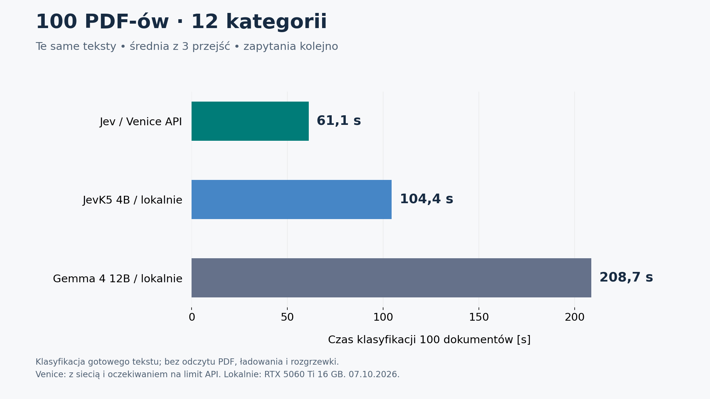

# Klasyfikacja 100 PDF-ów do 12 kategorii

Pomiar: 2026-10-07. Każdy model klasyfikował ten sam zestaw 100 dokumentów,
trzykrotnie, wybierając dokładnie jedną z 12 ogólnych kategorii.

| Model | Średnio na dokument | Mediana | Średnio 100 dokumentów |
|---|---:|---:|---:|
| Jev / Venice API | 0.611 s | 0.419 s | **61.07 s** |
| JevK5 4B / lokalnie | 1.044 s | 1.123 s | **104.37 s** |
| Gemma 4 12B / lokalnie | 2.087 s | 2.229 s | **208.71 s** |

Jev przez Venice osiągnął **3.42×** tempo Gemmy
i **1.71×** tempo lokalnego JevK5.
Stosunek średnich czasów Gemma / JevK5 wyniósł
**2.00×**.

**Czas Venice w tabeli zawiera oczekiwanie na limit API.** Na setkę składa się
średnio 43.59 s obsługi żądań z siecią oraz 17.48 s
oczekiwania. Sama obsługa żądań jest 4.79×
krótsza niż czas Gemmy, ale przy kolejnych setkach znaczenie ma też limit konta.



Wszystkie 900 mierzonych odpowiedzi zawierały kategorię z listy.
To sprawdzenie formatu odpowiedzi, nie 100% trafności: ten eksperyment mierzy
czas, bez ręcznie oznaczonego wzorca poprawnych etykiet.

## Kategorie

- Umowy i porozumienia.
- Finanse i rozliczenia.
- Wnioski, zgody i oświadczenia.
- Raporty i protokoły.
- Dokumenty urzędowe.
- Dokumenty prawne i sądowe.
- Sprawy pracownicze.
- Dokumentacja medyczna.
- Edukacja i szkolenia.
- Dokumentacja techniczna.
- Korespondencja i zawiadomienia.
- Inne dokumenty.

## Sposób pomiaru

- Wylosowano 100 unikalnych PDF-ów z istniejącego korpusu `scratch/jev50`
  (187 plików przed filtrowaniem), seed 20261007.
  Pomijano duplikaty, błędy odczytu oraz pliki z mniej niż 200 znakami tekstu.
  Dokumenty wybrano przed pomiarami, bez selekcji według wyniku modelu.
- Każdy model dostał identyczny tekst i te same opisy kategorii. Skróty SHA-256
  potwierdzają zgodność wejść we wszystkich 900 pomiarach.
- Maksymalnie 12 000 znaków z początku dokumentu oraz 4096 tokenów pełnego promptu
  według tokenizera JevK5. Drugi limit skrócił dodatkowo 13/100 tekstów,
  jednakowo dla wszystkich modeli. Zakresy tokenów różnych modeli nie są tożsame.
  Warstwa tekstowa niektórych PDF-ów zawiera błędy; nie poprawiano jej na podstawie
  odpowiedzi modelu. Najdłuższy po tokenizacji tekst `jev50_d090` miał
  30768 tokenów pełnego promptu przed dodatkowym
  limitem; po skróceniu zachowano 1279 znaków tekstu.
- Mierzono wyłącznie klasyfikację gotowego tekstu, bez OCR, opisywania dokumentu,
  podpisów i wycinków. Nie jest to czas analizy wszystkich stron całego PDF-a.
  Odczyt tekstu ze 100 PDF-ów trwał 26.00 s i jest poza tabelą.
- Każdy model: jedno syntetyczne żądanie rozgrzewki, potem trzy przejścia po
  100 dokumentów w tej samej kolejności. Zapytania szły kolejno, bez równoległości.
  Czas paczki to suma czasów klasyfikacji wraz z oczekiwaniem na limit API;
  nie obejmuje zapisu logów między żądaniami.
  Model lokalny był zwalniany przed uruchomieniem następnego.
- Gemma: `gemma4:12b`, Q4_K_M przez Ollamę, `think=false`, temperatura 0,
  kontekst 8192, do 64 tokenów odpowiedzi, krótki JSON z kategorią.
  Rzeczywiste wejścia: 377–4209 tokenów według Ollamy.
  Zmienny znacznik pomiaru na początku ograniczał ponowne użycie cache całego tekstu.
- JevK5: 4B BF16, natywny odczyt decyzji z logitów. Przy 12 opcjach licznik
  rzeczywistych wywołań potwierdził **jeden przebieg w każdym z 300 pomiarów**.
  Przy wcześniejszych 48 opcjach potrzebne były cztery. Bez generowania opisu,
  bez cache KV; czas obejmuje tokenizację i synchronizowaną pracę GPU.
- Oficjalny Jev: `jev-latest`, `POST /api/v1/decisions` w Venice. Czas zawiera
  HTTPS, sieć i oczekiwanie na limit liczby żądań. Każde żądanie zawierało
  jedno pytanie z 12 opcjami. API nie
  ujawnia wersji stojącej za aliasem ani czasu samego serwera.

## Trzy przejścia i uruchomienie

| Model | Przejście 1 | Przejście 2 | Przejście 3 |
|---|---:|---:|---:|
| Jev / Venice API | 61.00 s | 61.01 s | 61.20 s |
| JevK5 4B / lokalnie | 104.20 s | 104.35 s | 104.54 s |
| Gemma 4 12B / lokalnie | 207.56 s | 208.91 s | 209.65 s |

Ładowanie JevK5: 8.18 s; osobna rozgrzewka:
0.58 s. Pierwsze żądanie Gemmy wraz z ładowaniem:
6.89 s, w tym ładowanie według Ollamy
6.45 s. Rozgrzewka Venice:
0.36 s. Te wartości są wyłączone z tabeli wynikowej.

Lokalny sprzęt: NVIDIA GeForce RTX 5060 Ti, 16 GB.
JevK5 używał PyTorch 2.12.0.dev20260217+cu128,
Transformers 5.18.0, referencyjnych kerneli,
bez grafów CUDA, z limitem alokatora 80% VRAM. Szczyt aktywnej pamięci:
10.67 GiB.
Jest to porównanie tych konkretnych lokalnych konfiguracji i usługi chmurowej.

Pierwsza próba bez limitu tokenów wyczerpała VRAM przy długim wejściu.
Zachowano ją w `pilot-input-too-long`; nie wchodzi do wyników.
Po ustaleniu wspólnego limitu ponowiono cały test na wszystkich 100 dokumentach.

Pierwsza seria Venice otrzymała HTTP 429 po 100 zaakceptowanych decyzjach
(rozgrzewka i 99 dokumentów). Jest zachowana w `pilot-api-rate-limit`.
W końcowym przebiegu klient ograniczał wysyłanie do 100 żądań w 61 sekundach;
czas oczekiwania jest zapisany osobno i **wliczony w tabelę oraz wykres**.
To ustawienie klienta dobrane po zaobserwowanym błędzie, nie deklaracja
gwarantowanego limitu dla wszystkich kont Venice.
Dokumentacja opisuje [limity zależne od konta i modelu](https://docs.venice.ai/api-reference/endpoint/api_keys/rate_limits).

## Koszt Venice

301 żądań łącznie z rozgrzewką: 891,969
tokenów wejściowych. Szacowany koszt według katalogu API odczytanego podczas
testu: **$0.037463**.
Wcześniejsza seria przerwana limitem API: dodatkowo około **$0.012444**.
Łącznie te dwie serie: **$0.049907**.
To koszt obliczony z użycia tokenów, nie odczyt obciążenia rachunku.
Osobne próby demonstracyjne nie wchodzą do tej kwoty.

## Pliki i pokaz

- Protokół, teksty, surowe odpowiedzi, podsumowania i CSV dokument po dokumencie:
  `H:/podpisy/scratch/jevk5-classification-100x12/`.
- Wykres do prezentacji: `docs/assets/classification-100x12.png` oraz `.svg`.
- Poprzedni [raport 10 × 48](JEVK5_CLASSIFICATION.pl.md) i jego wyniki pozostały
  osobno. Zmieniły się kategorie, skład zestawu i limit wejścia, więc różnicy
  między starym a nowym testem nie można przypisać wyłącznie liczbie kategorii.
- [Instrukcja Venice i pokazu](VENICE.pl.md). Klucz pozostaje w ignorowanym `.env`.

Jedno przejście po 100 dokumentów, z wynikami w osobnym katalogu pokazu:

```powershell
.\scripts\run_classification_benchmark.ps1 -Model venice
.\scripts\run_classification_benchmark.ps1 -Model jevk5
.\scripts\run_classification_benchmark.ps1 -Model gemma
```

Uruchamiaj komendy kolejno. Domyślnie każda robi jedno przejście; `-Repeats 3`
wykonuje trzy. Każda oddziela żądanie rozgrzewki od pomiarów właściwych.
